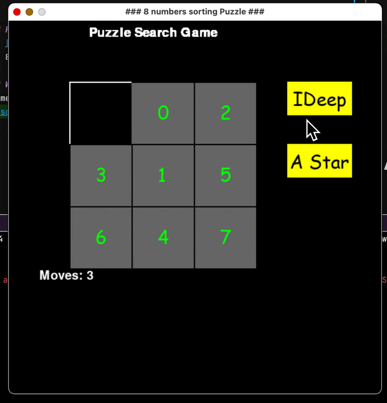

# AI Foundational Techniques to Solve an 8-Piece Puzzle
This project uses some AI techniques to solve an 8 piece puzzle within a 3x3 grid.
Dr. Ju Shen provided the initial code and I modified it to use iterative deepening and A* search to solve the puzzle.

## REQUIREMENTS
1. [x] (1) Your code is free of compilation error or runtime errors (10%)
2. [x] (2) For the iterative deepening search, your code can iteratively increase depth limit and  perform DFS correctly (10%)
3. [x] (3) Successfully return an optimal path by iterative deepening search (10%)
4. [x] (4) Correctly define Heuristic function h() for A-star search (10%)
5. [x] (5) Correctly compute the total cost f(S) = g(S) + h(S) for each move (10%)
6. [x] (6) A-star search correctly expand states in the right order (15%)
7. [x] (7) A-star search correctly get an optimal path (25%)
8. [x] (8) Provide a short document describing what you have achieved and limits, with some  snapshots (10%)

## AI Generated Functions
1. Modified a `hamming_distance()` function to calculate the number of misplaced tiles.
2. Learned a better way to swap indexes of a list, so used that function. Original is in scratchwork.
3. Had help with the A* part because I originally tried to build it recursively but learned pq was better.

## References
1. [Branch/Bound](https://www.geeksforgeeks.org/8-puzzle-problem-using-branch-and-bound/)
2. 8-puzzle problem [medium writeup](https://medium.com/@dpthegrey/8-puzzle-problem-2ec7d832b6db)

## What it should do
Something like this:

