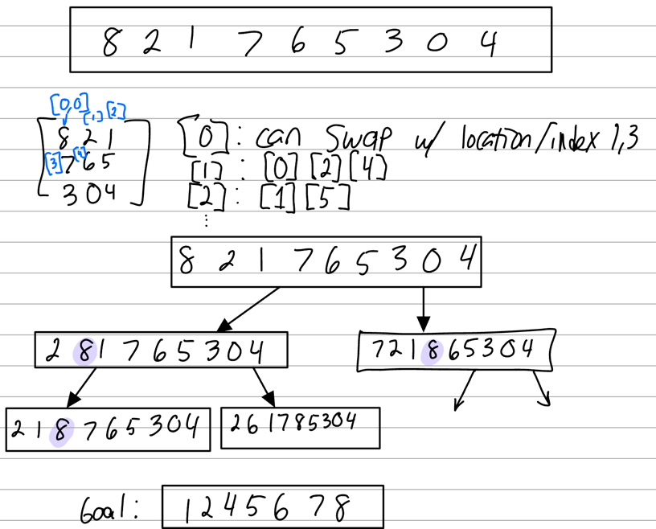

# Puzzle8 AI Techniques
This project uses some AI techniques to solve an 8 piece puzzle within a 3x3 grid.

## REQUIREMENTS
(1) Your code is free of compilation error or runtime errors (10%)
(2) For the iterative deepening search, your code can iteratively increase depth limit and
perform DFS correctly (10%)
(3) Successfully return an optimal path by iterative deepening search (10%)
(4) Correctly define Heuristic function h() for A-star search (10%)
(5) Correctly compute the total cost f(S) = g(S) + h(S) for each move (10%)
(6) A-star search correctly expand states in the right order (15%)
(7) A-star search correctly get an optimal path (25%)
(8) Provide a short document describing what you have achieved and limits, with some
snapshots (10%)

## References
1. [Branch/Bound](https://www.geeksforgeeks.org/8-puzzle-problem-using-branch-and-bound/)
2. 8-puzzle problem [medium writeup](https://medium.com/@dpthegrey/8-puzzle-problem-2ec7d832b6db)

## What it should do
Something like this:


## Changelog (newest->oldest)

### Jan 30 \@ 8AM 
1. Solution isn't memoized.
2. It's going deep. Need to implement a queue? Not iterative deepening yet.


### Earlier
Got DFS working! Not iterative deepening or A* yet.

 
### If Desperate - AI Solution
```python
from typing import List
from sol.PathNode import PathNode

def recursivelyFindSolution(node: PathNode, goalState: List[int], maxDepth: int = 10, visited=set()) -> List[PathNode]:
    """
    Recursively find a solution path from the initial state to the goal state.
    :param node: Represents information about a node in a map.
    :param goalState: The target state.
    :param maxDepth: Maximum allowed tree depth.
    :param visited: A set to keep track of visited states.
    :return: The path from the initial state to the goal state as a list of PathNode objects,
             or an empty list if no solution is found within the given depth.
    """
    # BASE CASE
    if node.state == goalState:
        return [node]

    if node.treeDepth >= maxDepth:
        return []

    # Memoization: Check if the current state has been visited before at the same or lower depth.
    if (tuple(node.state), node.treeDepth) in visited:
        return []

    visited.add((tuple(node.state), node.treeDepth))

    # RECURSIVE CASE
    children = node.generate_children()
    for child in children:
        # Recursively call the function on child nodes with the same depth limit.
        result = recursivelyFindSolution(child, goalState, maxDepth, visited)
        if result:
            return [node] + result

    return []  # No solutions found from this node.

def iterativeDeepening(puzzle: List[int], maxDepth=10) -> List[int]:
    print("DEBUG Trace solution.iterativeDeepening: Input Puzzle: {}".format(puzzle))
    goal_state = [0, 1, 2, 3, 4, 5, 6, 7, 8]
    root = PathNode(state=puzzle, treeDepth=0, parent=None)

    for depth in range(maxDepth + 1):
        # Use a set to store visited states at each depth.
        visited = set()
        solution_nodes = recursivelyFindSolution(root, goal_state, depth, visited)
        solution_path: List[int] = []  # stores solution as integers for assignment output.

        if solution_nodes:
            for n in solution_nodes:
                solution_path.append(n.lastPosSwap)
            return solution_path

    raise Exception("No solutions exist up to depth {}.".format(maxDepth))
```